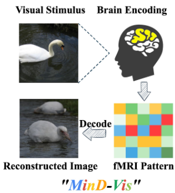

# AI Case Study

## Overview and Origin

* *Name of Project*

[**MinD-Vis**](https://mind-vis.github.io/) (Sparse **M**asked Bra**in** Modeling with **D**ouble-Conditioned Diffusion Model for **Vis**ion Decoding)

* *When was the project incorporated?*

**MinD-Vis was first launched in early November 2022.**

* *Who are the founders of the project?*

The founders of the project are **Zijiao Chen, Wan Lin Yue, and Juan Helen Zhou** of the National University of Singapore; **Jiaxin Qing** of the Chinese University of Hong Kong Department of Information Engineering; and **Tiange Xiang** of the Stanford University Vision and Learning Lab.

* *How did the idea for the project come about?*

**The idea for the project was not quite original, as other researchers have worked on the same thing. However, the project in general aims to deepen the understanding of the human visual system.**

* *How is the project funded? How much funding has it receieved?*

**The project is funded by the respective Universities each founder originates from. There are no specific metrics as to the amount of funding going into MinD-Vis.**

## Business Activities

* *What specific problem is the project trying to solve?*

**MinD-Vis takes fMRI scans of the brain when a patient is given a visual stimulus and decodes and reconstructs the visual stimulus based on the fMRI pattern. Decoding visual stimuli from brain recordings aims to
deepen our understanding of the human visual system and
build a solid foundation for bridging human and computer
vision through the Brain-Computer Interface.** 

* *Who is the project's intended customer? Is there any information about the market size of this set of customers?*

**This project is just that, a project, at this point in time. However, this technology offers major implications to the medical field such as enhanced communication with non-verbal patients, improved non-invasive monitoring of the brain, and other advancements regarding neuroscience research.**

* *What solution does this project offer that their competitors do not or cannot offer?*

**MinD-Vis offers a state-of-the-art 100-way top-1 classification accuracy on [GOD dataset](https://paperswithcode.com/dataset/god): 23.9%, outperforming the previous best by 66%.**

* *Which technologies are they currently using, and how are they implemented?* 

**MinD-Vis uses Sparse-Coded Masked Brain Modeling (SC-MBM), which is innovative and original to MinD-Vis, as an effective brain feature learner for vision decoding. Also, augmenting the [latent diffusion model](https://medium.com/@aguimarneto/what-is-latent-diffusion-in-ai-43aa1ad4f71e) with double conditioning (DC-LDM) allows MinD-Vis to enforce stronger decoding consistencies while allowing variance under the same semantics. Integrating the representation ability of SC-MBM with the generation ability of DC-LDM, MinD-Vis generates more plausible images with better preserved semantic information compared with previous methods**

## Landscape

